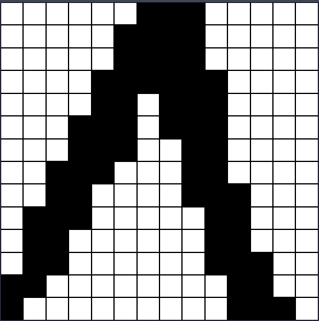

# Exploring Methods and Systems of AI

## Content:

- [Genetic Algorithm](#genetic-algorithm-)
- [Expert System](#expert-system-)
- [Hopfield Neural Network](#hopfield-neural-network-)

## Genetic Algorithm 🧬

### Task: ✈️

Given a list of cities, what is the shortest possible route that visits each city exactly once and returns to the origin
city?

### Functionality:

- Collecting cities to travel on the map of Ukraine 💙💛
- Storing and loading dataset of points from the
  MongoDB 
- Tweaking genetic algorithm with different parameters 🤓
- Client can track current state of the server's work and dynamically draw a current shortest path 🖼️
- All statistic stored in
  MongoDB 
- Server gather statistic and return a line chart on a request 📈

### Built With

#### Backend part:

- Java 21 
- Spring
  Boot 
- Vector API. Preview feature. SIMD machine.⚡
- VirtualThreadPerTaskExecutor 🤖
- StringTemplate ➕
-

MongoDB 

- Integration/Unit testing
- Lombok 🏝️
- JFreeChart 📈

#### Frontend part:

- React 🚀
- TypeScript 💪
- HTML 5️⃣
- SCSS 😎

### Preview:

Let's solve 32 points using a genetic algorithm. It would be 31! steps 🤯 without such a method.

## Expert System 👩‍🔬

### Task: 🧪

Create a versatile rule-based expert system capable of providing automated expert-level decision support across diverse
domains. Easily extendable with new rules.

### Functionality:

**🎓Rule Management:** Easily add new rules to the knowledge base and establish connections between existing and new
rules.

**🧠Rule Types:** Supports various rule types, including yes/no and formula-based rules. Formula-based rules allow
experts to define formulas with variables, and users can input values for these variables, enabling dynamic
decision-making.

**🔍Keyword Search:** A powerful search feature enables users to find specific rules by entering keywords, offering a
search experience similar to Google.

**💬Interactive Chat:** Engage in chat conversations with the system, providing user input for decision-making. The
system dynamically processes the information provided by the user and offers expert-level decisions based on the rules
in its knowledge base.

### Built With

#### Backend part:

- Java 21 
- Spring
  Boot 
- Neo4j 
- GraalVM ScriptEngine. _It is used to calculate the formulas provided by the expert._
- Lombok 🏝️
- Integration/Unit testing 🤯

#### Frontend part:

- React 🚀
- TypeScript 💪
- HTML 5️⃣
- SCSS 😎

### Preview:

#### Expert mode

#### User mode

### Hopfield Neural Network 🧠

Unveil the potential of the Hopfield Neural Network for pattern recall, whether from images or direct matrix
representations. This versatile neural network, inspired by human memory functions, excels at recognizing patterns
embedded within various data forms.

### Functionality:

**🖌️ Drawing within a Front-end Page:** Users can draw patterns on the webpage or submit matrix representations directly
to the server for processing.

**📷 Image and Matrix Processing:** Receive images or matrix data from clients, convert images to grayscale, and process
matrices to recognize embedded patterns.

**👀 Pattern Recognition:** Submit fragmented or incomplete patterns, either in image or matrix form, for restoration.
Simply specify the network name to trigger pattern retrieval from PostgreSQL for efficient reconstruction.

### Built With

#### Backend part:

- Java 21 
- Spring Boot 
- PostgreSQL 🐘
- Lombok 🏝️

#### Frontend part:

- React 🚀
- TypeScript 💪
- HTML 5️⃣
- SCSS 😎

#### Preview:

##### Image processing:

Create network1:

Fragment of pattern1:

Recalled pattern1:

Fragment of pattern2:

Recalled pattern2:

Create network2:

Fragments of letters:

Recalled letters:

##### Drawn patterns:

You can easily draw patterns on the webpage.

Create network:

Fragments of letters:

Recalled letters:

